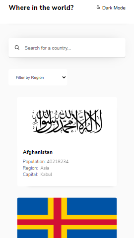

# Frontend Mentor - REST Countries API with color theme switcher solution

This is a solution to the [REST Countries API with color theme switcher challenge on Frontend Mentor](https://www.frontendmentor.io/challenges/rest-countries-api-with-color-theme-switcher-5cacc469fec04111f7b848ca). Frontend Mentor challenges help you improve your coding skills by building realistic projects.

## Table of contents

- [Overview](#overview)
  - [The challenge](#the-challenge)
  - [Screenshot](#screenshot)
  - [Links](#links)
- [My process](#my-process)
  - [Built with](#built-with)
  - [What I learned](#what-i-learned)
  - [Useful resources](#useful-resources)
- [Author](#author)

## Overview

### The challenge

Users should be able to:

- See all countries from the API on the homepage
- Search for a country using an `input` field
- Filter countries by region
- Click on a country to see more detailed information on a separate page
- Click through to the border countries on the detail page (Yet to do it)
- Toggle the color scheme between light and dark mode _(optional but did it)_

### Screenshot




### Links

- Solution URL: [Add solution URL here](https://your-solution-url.com)
- Live Site URL: [https://gillette-restcountries-api.netlify.app/](https://gillette-restcountries-api.netlify.app/)

## My process

### Built with

- Flexbox
- Mobile-first workflow
- [React](https://reactjs.org/) - JS library
- [Styled Components](https://styled-components.com/) - For styles

### What I learned

Getting to know about localeCompare was awesome for my growth and i did learn about how you can you the Object.keys or Object.values to specifically select a value or key in a complex object structure.

This project was fun to do overall

And a snippet code of what I loved most;

```js
const filteredData = data
	.filter(
		(country: UserJSON) =>
			country.name.common.toLowerCase().includes(value.toLowerCase()) &&
			country.region.toLowerCase().includes(selectedOption.toLowerCase()),
	)
	.sort((a: UserJSON, b: UserJSON) =>
		a.name.common.localeCompare(b.name.common),
	);
```

### Useful resources

- [React With TypeScript Best Practices](https://www.sitepoint.com/react-with-typescript-best-practices/) - This is an amazing article which helped me finally understand using react and typeScript. I'd recommend it to anyone still learning this concept.
- [React with TypeScript cheatsheet](https://github.com/typescript-cheatsheets/react) - This helped me for using react and typescript. I really liked this pattern and will use it going forward.
- [Styled-components](https://styled-components.com/) - What i used in styling the page and it was using because of its declarative styles and reusability.

## Author

- Frontend Mentor - [@Gillette10](https://www.frontendmentor.io/profile/Gillette10)
